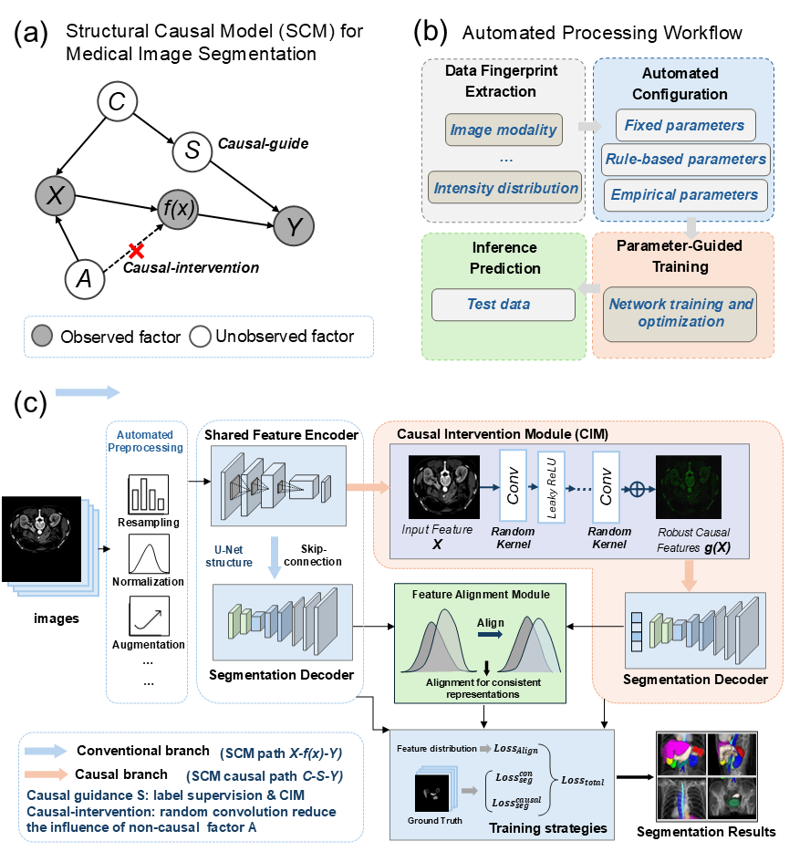

# Robust Multi-Organ Segmentation via Random Convolution Intervention and Causal Representation Learning

## Overview



We propose **CaDNet (Causal Dual-branch Segmentation Network)**, a causal-inspired dual-branch framework that integrates **causal representation learning** and **random convolution intervention** with the automated **nnU-Net** framework for robust multi-organ medical image segmentation.

CaDNet consists of two complementary segmentation branches with a shared encoder. The causal branch employs a **Causal Intervention Module (CIM)** to introduce structured random convolution perturbations and to learn more stable causal representations. A **Feature Alignment Module (FAM)** further encourages consistent representations between the two branches, improving robustness against domain-specific and non-causal variations.

---

## Getting Started

### Prerequisites

Our framework is implemented in **PyTorch** and built upon the **nnU-Net** framework.

* Python
* PyTorch
* nnU-Net
* batchgeneratorsv2
* dynamic-network-architectures

### 1. Install PyTorch

Please install PyTorch according to your CUDA environment from the official PyTorch website:

https://pytorch.org/

### 2. Install nnU-Net

```bash
pip install nnUNet
```

### 3. Install batchgeneratorsv2

Clone and install the required package:

```bash
git clone https://github.com/MIC-DKFZ/batchgeneratorsv2.git
cd batchgeneratorsv2
pip install -e .
```

### 4. Install dynamic-network-architectures

Clone and install the network architecture package:

```bash
git clone https://github.com/MIC-DKFZ/dynamic-network-architectures.git
cd dynamic-network-architectures
pip install -e .
```

---
## Generate Network Configuration

The customized `nnUNetPlans.json` configuration for CaDNet can be generated using:

```bash
python generate_config.py
```
The generated configuration specifies the CaDNet architecture used by nnU-Net.

---

## Model Configuration

CaDNet is implemented within the nnU-Net framework. To use the proposed network architecture, modify the corresponding `nnUNetPlans.json` file and specify the custom network class.

For example:

```json
{
    "architecture": {
        "network_class_name": "dynamic_network_architectures.architectures.mynet.MyNet"
    }
}
```

Replace `MyNet` with the corresponding CaDNet network implementation provided in this repository.

The custom architecture can then be automatically constructed by nnU-Net according to the specified network configuration.

---

## Running the Model

### Training

#### Dataset Preprocessing

Before training, preprocess the dataset and verify its integrity using the standard nnU-Net pipeline:

```bash
nnUNetv2_plan_and_preprocess -d 1 --verify_dataset_integrity
```

Here, `-d 1` specifies the dataset ID.

#### Five-Fold Cross-Validation Training

CaDNet follows the standard nnU-Net training procedure with five-fold cross-validation.

For 3D data, use:

```bash
nnUNetv2_train 1 3d_fullres 0
```

where `1` denotes the dataset ID and `0` denotes the first fold. The remaining folds can be trained by replacing `0` with task id.

For 2D data, replace `3d_fullres` with `2d`:

```bash
nnUNetv2_train 1 2d 0
```

The remaining training configurations, including preprocessing, data augmentation, optimization, and cross-validation, follow the standard nnU-Net pipeline.
The proposed CaDNet architecture is specified through the customized nnUNetPlans.json configuration and is automatically integrated into the nnU-Net training pipeline.

### Inference

After training, run inference using:

```bash
python ./Code/predict_from_raw_data.py
```

The prediction configuration should be adjusted according to the trained model and target dataset.

> **Note:** The exact training and inference commands may vary depending on the dataset and nnU-Net configuration. Please refer to the corresponding scripts in `Code/` for dataset-specific settings.

---

## Model Components

CaDNet contains the following major components:

### 1. Dual-Branch Segmentation Architecture

CaDNet adopts a dual-branch architecture consisting of:

* **Segmentation Branch**: provides the primary segmentation representation and prediction.
* **Causal Branch**: learns more stable representations through causal intervention.

The two branches share the encoder while maintaining branch-specific feature processing and segmentation heads.

### 2. Causal Intervention Module (CIM)

The **Causal Intervention Module** introduces structured random-convolution interventions into intermediate features. These interventions perturb non-causal and domain-specific variations while encouraging the network to learn representations that are more stable across different imaging domains.

### 3. Feature Alignment Module (FAM)

The **Feature Alignment Module** maps the feature representations from the two branches into a shared feature space and encourages their consistency.

This alignment helps preserve segmentation-relevant information while reducing the influence of unstable, domain-specific features.

---

## Datasets

CaDNet can be applied to multi-organ and cross-domain medical image segmentation tasks.

The experiments in this work include the following datasets:

* **AMOS**: https://amos22.grand-challenge.org/Instructions/
* **ACDC**: https://zmiclab.github.io/zxh/0/myops20/
* **MSD**: http://medicaldecathlon.com/
* **MyoPS2020**: https://humanheart-project.creatis.insa-lyon.fr/database/#collection/637218c173e9f0047faa00fb


---

## Analysis

The repository also provides scripts for evaluating segmentation performance.

The primary evaluation metrics include:

* **Dice Similarity Coefficient (DSC)**
* **95th Percentile Hausdorff Distance (HD95)**

Example:

```bash
python ./Code/seg_metrices.py
```

The evaluation scripts can be adapted according to the prediction and ground-truth directory structure.

---

## Repository Structure

```text
CaDNet/
│
├── Code/
│   ├── ...
│   └── ...
│
├── overview.png
├── nnUNetPlans.json
├── LICENSE
└── README.md
```

---

## Authors

* **Huijun Li**
* **Zequn Zhang**
* **Yuxi Chen**
* **Peng Wang**
* **Chon Lok Lei**
* **Hongyan Wu**

## License

This project is licensed under the **BSD 3-Clause License**. See the [LICENSE](LICENSE) file for details.

---

## Acknowledging This Work

If you use this repository or build upon this work, please cite:

```bibtex
@article{CaDNet,
  title={Robust Multi-Organ Segmentation via Random Convolution Intervention and Causal Representation Learning},
  author={...},
  journal={...},
  year={...}
}
```

---

## Acknowledgements

This work builds upon the excellent **nnU-Net** framework and related open-source projects.

We thank the authors and developers of:

* nnU-Net
* batchgeneratorsv2
* dynamic-network-architectures

for making their work publicly available.
